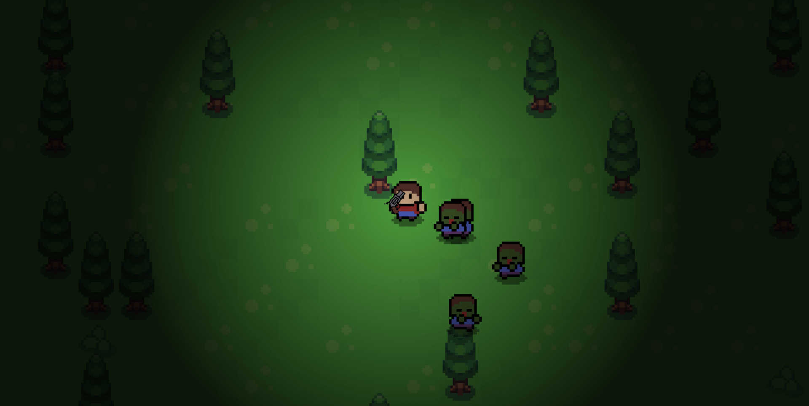
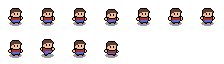
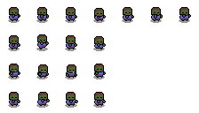

# ZOMBIE SURVIVAL GAME

A 2D top-down zombie survival game built with C++ and SDL2, featuring AI-powered zombies, dynamic lighting, and procedural terrain generation.



*Navigate through a dangerous world, fight off intelligent zombies, and survive as long as possible!*

## 🎮 GAME OVERVIEW

This zombie survival game demonstrates advanced C++ programming concepts including object-oriented design, pointer management, and real-time game systems. Players must navigate through a procedurally generated world while fighting off zombies that use A* pathfinding to hunt them down.

**Key Highlights:**
- Real-time zombie AI with pathfinding algorithms
- Dynamic lighting and visual effects
- Procedural world generation
- Sprite-based animation system
- Collision detection and physics

## ✨ FEATURES

### Gameplay
- **Top-down 2D perspective** with smooth character movement
- **Intelligent zombie AI** using A* pathfinding for realistic hunting behavior
- **Dynamic shooting mechanics** with mouse-controlled aiming
- **Progressive difficulty** as more zombies spawn over time
- **Score system** tracking zombie eliminations and survival time
- **Zoom functionality** for tactical overview or detailed view

### Technical Features
- **Object-oriented architecture** with inheritance (Human → Player/Zombie)
- **Memory management** with proper pointer handling
- **Real-time collision detection** between bullets, players, and zombies
- **Sprite animation system** with multiple animation states
- **Dynamic lighting effects** for atmospheric gameplay
- **Procedural terrain generation** for varied gameplay experiences

## 🎯 CONTROLS

| Key | Action |
|-----|--------|
| `W` | Move up |
| `A` | Move left |
| `S` | Move down |
| `D` | Move right |
| `Left Mouse` | Shoot |
| `P` | Zoom in |
| `M` | Zoom out |

## 🧠 GAME MECHANICS

- **Zombie Behavior**: Zombies patrol the area and chase the player when within their view range (200 units)
- **Combat System**: Each zombie deals 10 damage when close enough to attack
- **Health System**: Game ends when player health reaches zero
- **Scoring**: Points awarded for each zombie eliminated
- **Survival Challenge**: Increasing difficulty over time

## 🛠️ TECHNICAL IMPLEMENTATION

### Architecture
```
Human (Base Class)
├── Player (Inherits from Human)
└── Zombie (Inherits from Human)
```

### Key Systems
- **Pathfinding**: A* algorithm implementation for zombie movement
- **Animation**: Frame-based sprite animation with multiple states (idle, walking, attacking)
- **Collision Detection**: Bounding box collision for bullets and entities
- **Memory Management**: Safe pointer usage and resource cleanup
- **Rendering**: SDL2-based texture rendering with zoom support

### File Structure
```
├── src/           # Source code implementation
├── include/       # Header files and class declarations
├── assets/        # Game sprites, textures, and media
├── lib/           # SDL2 libraries and dependencies
└── main.cpp       # Application entry point
```

## 🚀 GETTING STARTED

### Prerequisites
- Windows operating system
- C++ compiler (MinGW recommended)
- SDL2 and SDL2_image libraries (included)

### Installation
1. Clone the repository
2. Ensure SDL2 DLL files are in the project directory:
   - `SDL2.dll`
   - `SDL2_image.dll`
3. Compile using the included Makefile:
   ```bash
   make
   ```
4. Run the game:
   ```bash
   ./main.exe
   ```

## 🎨 ASSETS

The game uses custom sprite sheets located in the assets directory:
- **Characters**: Player and zombie sprite animations
- **Environment**: Procedural tileset for terrain generation
- **UI Elements**: Score display and game interface components




## 🔮 FUTURE ENHANCEMENTS

This project serves as a foundation for a larger RPG village system with AI agents. Planned improvements include:

- **Village Simulation**: NPC villagers with daily routines and interactions
- **Quest System**: Dynamic mission generation and completion
- **Advanced AI**: More sophisticated NPC behavior patterns
- **Multiplayer Support**: Network-based cooperative gameplay
- **Expanded World**: Larger maps with multiple biomes and locations

## 🎓 LEARNING OBJECTIVES

This project was created to explore and demonstrate:
- **C++ Programming**: Advanced language features and best practices
- **Game Development**: Real-time systems and game loop implementation
- **AI Algorithms**: Pathfinding and decision-making systems
- **Memory Management**: Proper pointer usage and resource handling
- **Software Architecture**: Object-oriented design patterns

## 📄 LICENSE

This project is created for educational purposes and personal learning.

## 🙏 ACKNOWLEDGMENTS

- Built with [SDL2](https://www.libsdl.org/) graphics library
- Pathfinding algorithms inspired by classic AI techniques
- Created as a stepping stone toward more complex game development projects

---

*This zombie survival game represents the first step in a journey toward creating complex AI-driven game worlds. Each zombie eliminated brings us closer to understanding the intricate dance between player agency and artificial intelligence.*
```